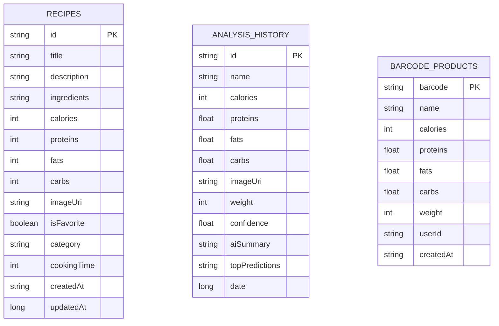
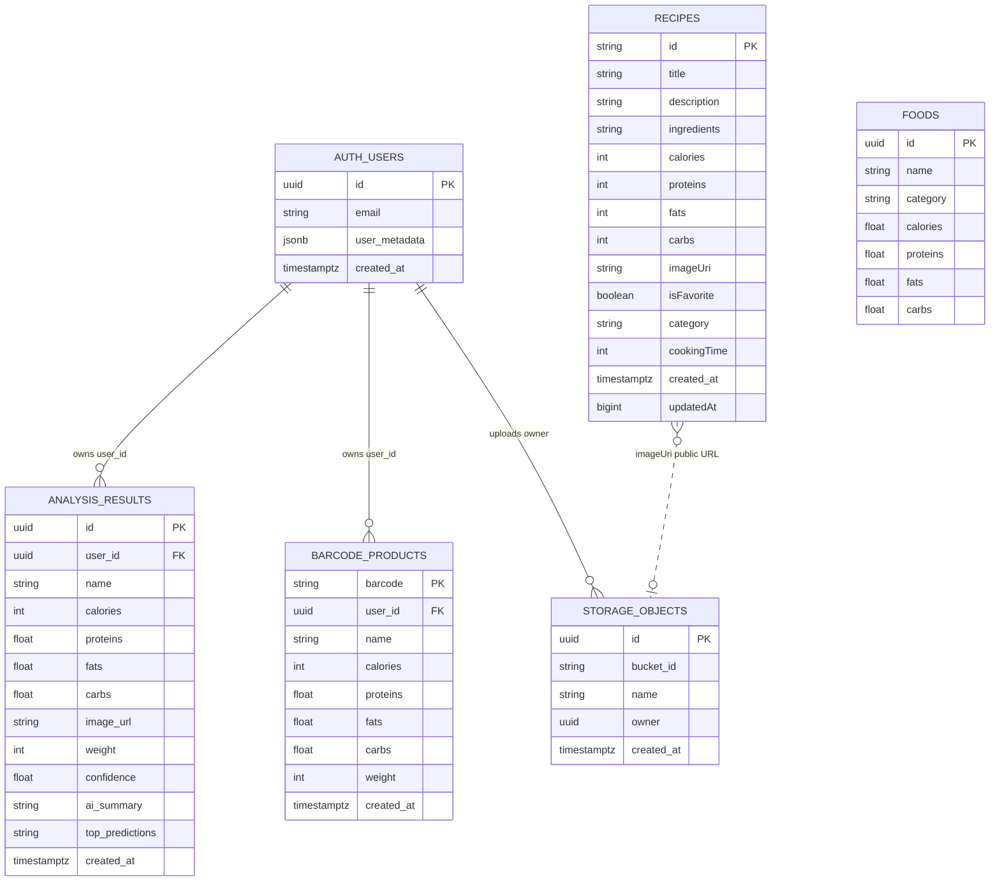

# ER-диаграммы CookBookAI

## Room, локальная база данных

В локальной базе Room используются три таблицы. В коде приложения внешние ключи между ними не объявлены: рецепты, история ИИ-анализа и продукты по штрихкоду хранятся независимо.

## Supabase, удаленная база данных и Storage

В Supabase данные пользователя связаны с таблицами `analysis_results` и `barcode_products` через поле `user_id`. Рецепты в текущей реализации приложения не содержат `user_id`, поэтому строгой связи `auth.users -> recipes` в коде нет. Изображения рецептов загружаются в Supabase Storage bucket `recipe-images`, а в таблице `recipes` хранится публичная ссылка в поле `imageUri`.

