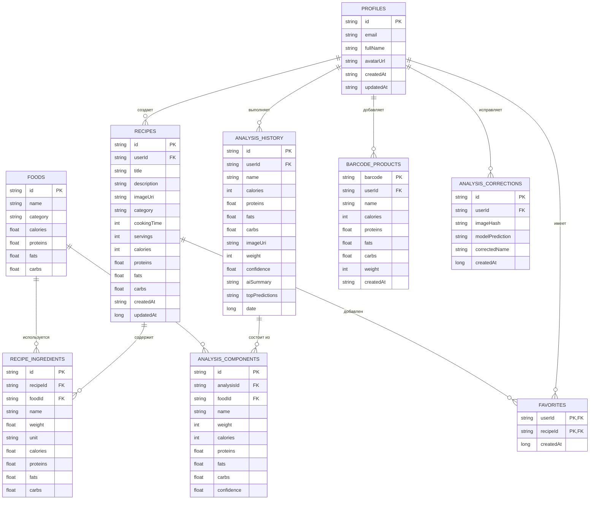
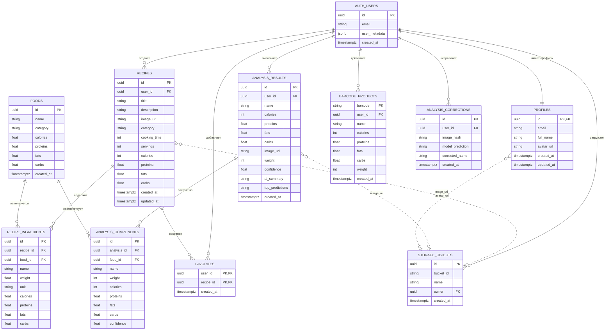

# Итоговые ER-диаграммы CookBookAI

Эти диаграммы объединяют текущую реализацию проекта и идеальную нормализованную структуру БД для диплома.  
В текущем приложении часть данных уже реализована проще: например, избранное хранится полем `isFavorite`, ингредиенты рецепта хранятся строкой, а компоненты анализа сериализуются в результате. В итоговой дипломной схеме эти данные вынесены в отдельные таблицы, чтобы показать правильную структуру связей.

## Room

## Supabase

