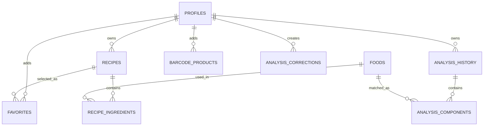
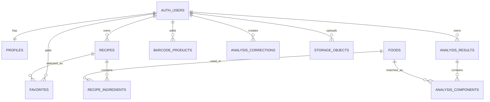

# Идеальная структура баз данных CookBookAI

## Room

Room используется как локальная база данных на устройстве. Она нужна для быстрого доступа к данным, офлайн-работы и локального кэша.

| Таблица | Назначение | Основные связи |
|---|---|---|
| `profiles` | Локальный кэш профиля пользователя | `profiles.id` соответствует `auth.users.id` в Supabase |
| `foods` | Локальный справочник КБЖУ продуктов и блюд | Используется в `recipe_ingredients.foodId` и `analysis_components.foodId` |
| `recipes` | Рецепты пользователя | `recipes 1:N recipe_ingredients`, `recipes N:M profiles через favorites` |
| `recipe_ingredients` | Ингредиенты рецепта | `recipeId -> recipes.id`, `foodId -> foods.id` |
| `favorites` | Избранные рецепты | Составной ключ `userId + recipeId` |
| `analysis_history` | История ИИ-анализа блюд | `analysis_history 1:N analysis_components` |
| `analysis_components` | Компоненты составного блюда | `analysisId -> analysis_history.id`, `foodId -> foods.id` |
| `barcode_products` | Продукты, найденные или добавленные по штрихкоду | Связь с пользователем через `userId` |
| `analysis_corrections` | Исправления результата модели пользователем | Уникальная пара `userId + imageHash` |

### Room ER-связи

## Supabase

Supabase используется как удаленная база данных, система авторизации и хранилище файлов.

| Таблица | Назначение | Основные связи |
|---|---|---|
| `auth.users` | Системная таблица пользователей Supabase Auth | Родительская таблица для пользовательских данных |
| `profiles` | Профиль пользователя | `profiles.id -> auth.users.id` |
| `foods` | Центральный справочник КБЖУ | Используется при расчете рецептов и анализа |
| `recipes` | Рецепты пользователя | `user_id -> auth.users.id` |
| `recipe_ingredients` | Ингредиенты рецептов | `recipe_id -> recipes.id`, `food_id -> foods.id` |
| `favorites` | Избранные рецепты | `user_id -> auth.users.id`, `recipe_id -> recipes.id` |
| `analysis_results` | Результаты ИИ-анализа | `user_id -> auth.users.id` |
| `analysis_components` | Компоненты результата анализа | `analysis_id -> analysis_results.id`, `food_id -> foods.id` |
| `barcode_products` | Продукты по штрихкоду | `user_id -> auth.users.id` |
| `analysis_corrections` | Исправления модели | `user_id -> auth.users.id`, `image_hash` для кэша |
| `storage.objects` | Системная таблица Supabase Storage | Хранит файлы из buckets `recipe-images` и `avatars` |

### Supabase ER-связи

## Пояснение для диплома

В идеальной структуре база данных нормализована: рецепты, ингредиенты, история анализа, компоненты составных блюд и избранное хранятся в отдельных таблицах. Это позволяет не дублировать данные, корректно хранить составные блюда, связывать записи с конкретным пользователем и синхронизировать локальную Room-базу с удаленной Supabase-базой.

Файлы SQL:

- `docs/ideal_room_schema.sql`
- `docs/ideal_supabase_schema.sql`
